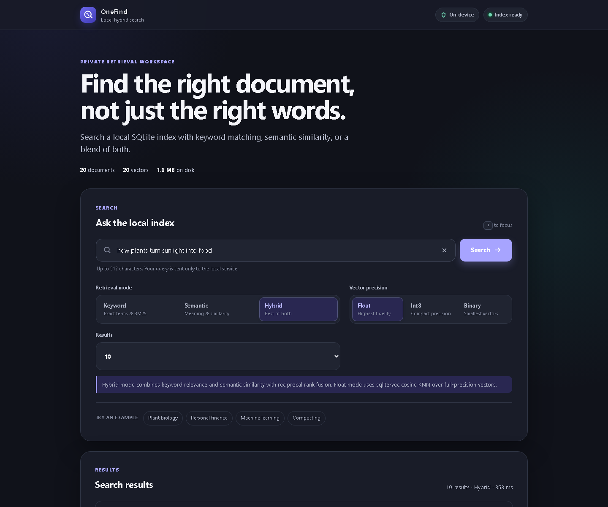
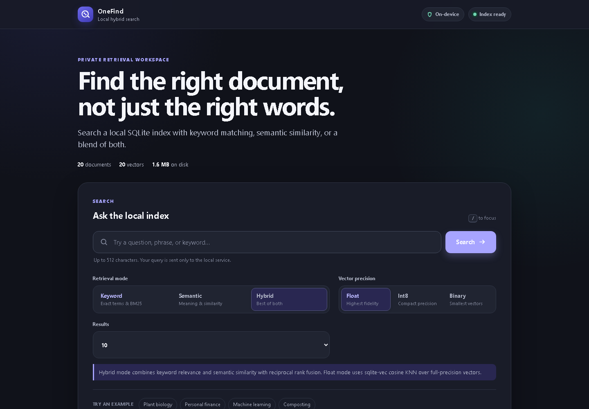
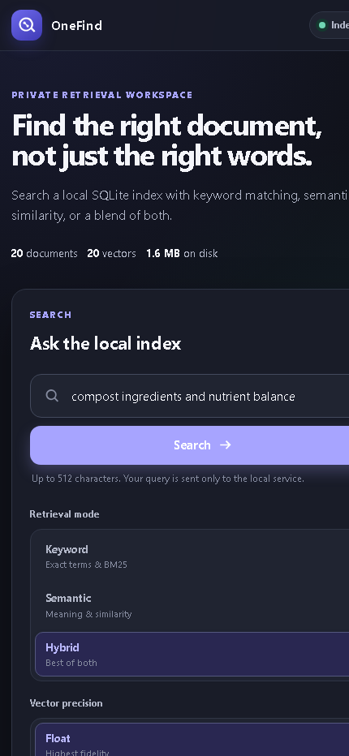

# OneFind — Free Local Hybrid Information Retrieval

**OneFind** combines SQLite FTS5 keyword search, sqlite-vec float KNN, quantized semantic ranking, and Reciprocal Rank Fusion in one local SQLite file. It ships as a Python library, a lowercase cross-platform CLI, a polished localhost web UI, reproducible BEIR evaluations, and a 20-document offline demo corpus.

Everything runs on free, local CPU infrastructure. There are no paid APIs, cloud services, hosted vector databases, telemetry, or frontend dependencies.

> Corrected v1.1 evidence supersedes the original prototype reports after the BM25, rerank-score, and fusion fixes. See `benchmarks/reports/` and `HOW_TO_RUN.md`.

## Highlights

- Correct strongest-first BM25 ranking with deterministic tie-breaking.
- Native float cosine KNN through sqlite-vec.
- Exact int8 and binary ranking in bounded NumPy blocks.
- Hybrid RRF plus weighted linear fusion with exact endpoint passthrough.
- Optional cosine reranking over a configurable 50-document-per-leg candidate pool.
- Transactional document, FTS, chunk, and vector writes.
- Collision-safe relative-path document IDs and JSONL ingestion.
- Atomic, manifest-bound evaluation databases.
- 20 cross-domain sample documents and 26 gold retrieval queries.
- 112 automated tests, including fake-model edge cases and local MiniLM integration.
- Responsive, accessible, CSP-protected UI packaged inside the wheel.
- CPU-only operation with a reusable local model cache.

## Quickstart

```bash
git clone https://github.com/WebDclassified/OneFind.git
cd OneFind
python -m venv .venv
```

Activate the environment:

```powershell
# Windows
.\.venv\Scripts\Activate.ps1
```

```bash
# macOS / Linux
source .venv/bin/activate
```

Install the complete free local stack:

```bash
python -m pip install --upgrade pip
pip install -e ".[model,eval,serve,dev]"
```

Build and evaluate the expanded offline corpus:

```bash
onefind check --full
onefind index ./sample-data --db demo.db --embed
onefind smoke --db demo.db --queries sample-data/queries.jsonl
```

Start the UI:

```bash
onefind serve --db demo.db --port 8080
```

Open <http://127.0.0.1:8080/>.

Run all tests:

```bash
pytest
```

## CLI

| Command | Purpose |
|---|---|
| `onefind check` | Verify Python, SQLite FTS5, sqlite-vec, and model availability |
| `onefind index PATH` | Index a folder, text file, or JSONL corpus |
| `onefind search QUERY` | Run lexical, semantic, or hybrid retrieval |
| `onefind eval DATASET` | Build and evaluate a BEIR-style dataset |
| `onefind sweep-alpha DATASET` | Compare linear fusion weights against RRF |
| `onefind smoke` | Run JSONL gold queries against an existing index |
| `onefind serve` | Start the secure local web application |

## Architecture

```text
CLI / web UI / evaluation harness
                 │
                 ▼
       onefind.search dispatcher
        ┌────────┼──────────┐
        ▼        ▼          ▼
     FTS5 BM25  float KNN  hybrid RRF
        │        │          │
        └────────┴────┬─────┘
                      ▼
               one SQLite file
      documents · chunks · FTS · vectors · manifest
```

### Retrieval paths

- **Keyword:** SQLite FTS5/BM25, strongest match first.
- **Semantic float:** native sqlite-vec cosine KNN over normalized float32 vectors.
- **Semantic int8:** globally scaled 8-bit cosine ranking in bounded blocks.
- **Semantic binary:** sign-bit Hamming ranking in bounded blocks.
- **Hybrid:** RRF by default; linear normalization is available for research comparisons.
- **Rerank:** one query encoding, complete fused-pool cosine scoring, and refreshed output scores.

## Sample retrieval corpus

The bundled `sample-data/` directory contains 20 short documents across:

- plant biology and nutrition;
- exercise and footwear;
- food fermentation;
- intertidal ecology;
- bicycle mechanics;
- sleep neuroscience;
- composting and agriculture;
- cloud formation;
- music theory;
- caption accessibility;
- corrosion and materials;
- geometry and architecture;
- library operations;
- personal finance;
- vector search;
- ceramics;
- two same-stem documents in different folders to exercise identity safety.

`sample-data/queries.jsonl` provides 26 cases (25 answerable plus one no-answer) for lexical, semantic, hybrid, disambiguation, and abstention behavior. The current local run achieves **1.000 Hit@3, 1.000 MRR@5, and 1.000 no-answer accuracy**.

## Corrected benchmark evidence

### Corrected full runs — 2026-09-24

| Configuration | SciFact nDCG@10 | NFCorpus nDCG@10 |
|---|---:|---:|
| lexical BM25 | 0.0467 | 0.2073 |
| semantic float | 0.6451 | 0.3167 |
| semantic int8 | 0.6465 | 0.3160 |
| semantic binary | 0.5827 | 0.2761 |
| hybrid float (RRF) | **0.6568** | **0.3466** |
| hybrid int8 (RRF) | **0.6582** | 0.3465 |
| hybrid binary (RRF) | 0.5959 | 0.3169 |
| hybrid float + cosine rerank | 0.6451 | 0.3167 |

**What changed and what the corrected evidence says:**

- Hybrid float beats the best single mode on both datasets: +0.0117 on SciFact and +0.0299 on NFCorpus.
- Int8 remains extremely close to float quality, but the current exact bounded scan is much slower; this implementation does **not** reproduce the paper's quantized speed advantage.
- Binary loses quality and is still slower than native float KNN on these runs. Its value is a mathematical configuration study, not a performance win.
- Pure-cosine reranking hurts both datasets once the deeper 100-document fused pool is rescored. RRF remains the safer default.
- The original ≤150 ms p95 goal is not met by vector modes on this CPU. Float-hybrid p95 is 174.8 ms on SciFact and 218.3 ms on NFCorpus; reports preserve the real values.
- The linear alpha sweep is effectively tied with RRF: SciFact linear α=0.1 scores 0.6572 versus RRF 0.6568, and NFCorpus linear α=0.2 scores 0.3470 versus RRF 0.3466. A 0.0004 single-run difference is not strong evidence of superiority.

Full provenance-rich reports:

- [`eval-scifact-2026-09-24.md`](benchmarks/reports/eval-scifact-2026-09-24.md)
- [`eval-nfcorpus-2026-09-24.md`](benchmarks/reports/eval-nfcorpus-2026-09-24.md)
- [`alpha-sweep-scifact-2026-09-24.md`](benchmarks/reports/alpha-sweep-scifact-2026-09-24.md)
- [`alpha-sweep-nfcorpus-2026-09-24.md`](benchmarks/reports/alpha-sweep-nfcorpus-2026-09-24.md)

The reports capture the resolved runtime revision when available; this run honestly records `unpinned` for the sentence-transformers model. Dataset files, code state, package versions, and selected IDs are recorded. These are single-run measurements, not confidence intervals.

Historical `2026-08-26` reports are retained for transparency but are not valid evidence for the corrected implementation because the original prototype reversed BM25 ordering and reranking retained stale fusion scores.

Regenerate current evidence with:

```bash
onefind eval scifact --db data/scifact.db
onefind eval nfcorpus --db data/nfcorpus.db
onefind sweep-alpha scifact --db data/scifact.db
onefind sweep-alpha nfcorpus --db data/nfcorpus.db
```

## Web UI

The UI lives in `src/onefind/static/` and is included in the wheel.



| Idle workspace | Mobile results |
|---|---|
|  |  |

### Comprehensive browser evidence

The root [`sshot/`](sshot/) directory contains 21 Playwright screenshots covering every documented UI state, retrieval mode/precision, result-count option, URL restoration, dark mode, mobile layout, lexical-only capabilities, no-index behavior, network/validation errors, and inert rendering of hostile HTML. Machine-readable assertions and console results are in [`sshot/manifest.json`](sshot/manifest.json).

Reproduce the browser evidence with an existing local Chrome installation:

```bash
pip install -e ".[browser]"
python tools/browser_check.py --output sshot
```

- semantic and hybrid controls follow index capabilities;
- all indexed text is rendered with DOM text nodes or validated highlight segments;
- no response content is inserted as HTML;
- CSP, `nosniff`, frame denial, no-referrer, and permissions restrictions are enabled;
- loading, idle, no-index, empty, error, and result states are explicit;
- native radio groups expose mode and precision choices accessibly;
- request cancellation and sequence checks prevent stale responses from replacing newer results;
- the server binds to loopback unless remote exposure is explicitly acknowledged.

## Data integrity and safety

- Text/JSONL documents use collision-free IDs.
- Embedded indexes reject lexical-only updates that would leave vectors stale.
- Late model attachment backfills missing vectors.
- Encoder output shape, finite values, and zero vectors are validated.
- Failed batches roll back; failed evaluation builds never replace the target database.
- Evaluation manifests bind dataset hashes, selected IDs, model revision, metrics, and configuration.
- Dataset downloads use temporary files and atomic publication.
- Quantized scans are block-bounded and detect concurrent index changes.
- Reset is disabled unless an explicit token is supplied at startup.

## Repository map

| Path | Purpose |
|---|---|
| `src/onefind/` | Library, CLI, evaluator, and server |
| `src/onefind/static/` | Packaged no-build web interface |
| `tests/` | 112 unit, integration, API, and packaging tests |
| `sample-data/` | 20 documents plus 26 gold queries |
| `benchmarks/reports/` | Generated evaluation and extension reports |
| `docs/` | Product, architecture, flow, UI, backend, plan, and references |
| `HOW_TO_RUN.md` | Complete local reproduction guide |
| `FORMAL_PROJECT_REPORT.md` | Academic report with historical context and corrected-evidence notice |
| `LICENSE` | MIT license |

## Free and local by design

OneFind intentionally avoids recurring-cost components. The default stack uses Python, SQLite, FTS5, sqlite-vec, NumPy, open-source sentence-transformers, FastAPI, and vanilla browser APIs. Models and datasets are downloaded once and cached locally.

## License

MIT. See `LICENSE`.
